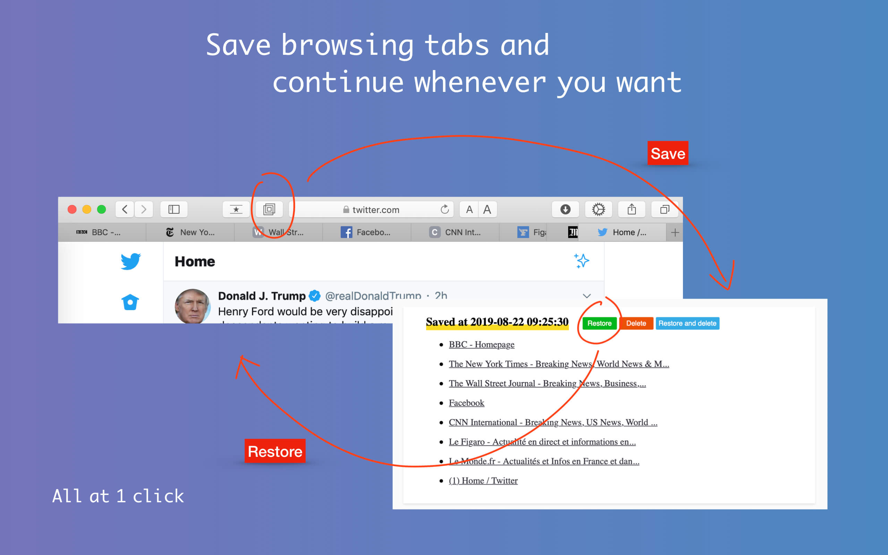
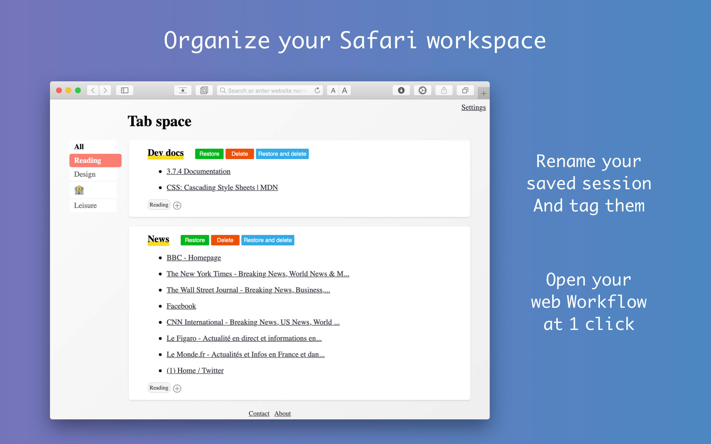
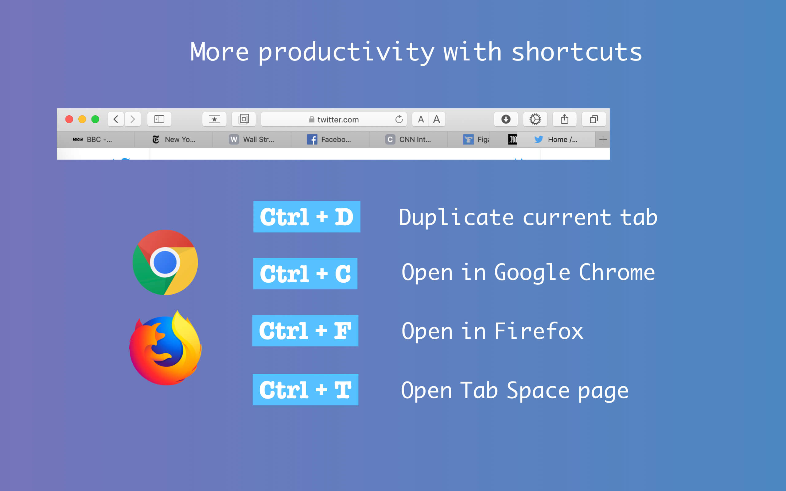

Tab Space is a Safari extension app which is born for improving web browsing productivity.

> This repo contains the project site and the static pages cooperating with Tab Space in Safari. It DOES NOT CONTAIN the original Xcode project which builds the app itself. 

#### Related links:
- [Tab Space Homepage](http://mytab.space)
- [Product Hunt page](https://www.producthunt.com/posts/tab-sapce)
- [中文介绍](https://sspai.com/post/56315)

## Tab Space - Born for improving your web browsing productivity.

Tab Space is a Safari extension app which is born for improving web browsing productivity.

It mainly includes the following functions:

- Save your browsing tabs at 1 click (just like OneTab in Chrome)，and restore these tabs whenever you want. 

- Tag system. You can mark your saved sessions with custom tags and use this app as a web browsing workflow launcher. For example, under my tag "Reading", I can launch my "News" workflow by opening all my favorite news websites at 1 click.

- Shortcuts for Safari which offer the long missing function:
    - Ctrl + L -- Close left tabs
    - Ctrl + R -- Close right tabs 
    - Ctrl + Q -- Close all other tabs
    - Ctrl + D -- Duplicate current tab
    - Ctrl + C -- Open in Chrome
    - Ctrl + F -- Open in Firefox
    - Ctrl + T -- Open Tab Space
    - Ctrl + B -- Save selected text to Bear, finally you have a Web Clipper for Safari

In addition, if you want to add Tab Space as a bookmark or to set it as homepage, the url you should use is "http://tabspacestatic.joyuer.cn/redirect.html".

Please enjoy and report potential bugs to me. Thanks!
