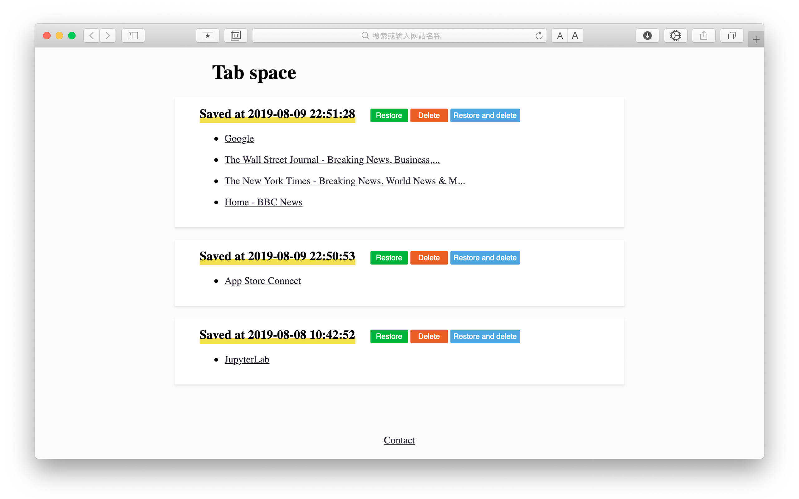

## Welcome to GitHub Pages

Tab Space saves your tabs as a workspace at 1 click.

There is a famous extension in Chrome for this use, but it does not work in Safari. Well, I am a Safari fans, so I wrote this. 

If you want to go to Tab Space page directly without saving current tabs, press "Ctrl + T".

if you want to add Tab Space as a bookmark or to set it as homepage, the url you should use is "http://yuanzhoucq.github.io/Tab-Space/redirect.html".

In addition, with this app installed, you can duplicate your active tab by pressing "Ctrl + D".

Please enjoy and report potential bugs to me. Thanks!
